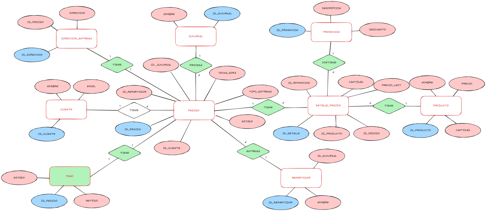

# 🍔 Food Delivery Database System

Este repositorio contiene el diseño y la implementación de una base de datos relacional para una cadena de restaurantes. El proyecto simula un entorno de producción con tablas normalizadas, procedimientos almacenados y triggers para la integridad de datos.

## 📂 Contenido del Repositorio

* **`sql_scripts/`**: Contiene todo el código fuente SQL necesario para desplegar la base de datos.
    * `01_schema_creation.sql`: Estructura DDL (Tablas y relaciones).
    * `02_data_population.sql`: Datos semilla para pruebas.
    * `03_stored_procedures.sql`: Vistas, Funciones, Triggers y Store Procedures.
    * `04_testing.sql`: Scripts para probar la funcionalidad.
* **`docs/`**: Documentación funcional detallada en PDF.

## 🛠️ Instalación y Uso

1.  Clonar este repositorio.
2.  Abrir los scripts en **MySQL Workbench** o cualquier cliente SQL.
3.  Ejecutar los scripts en orden numérico (01 -> 04).

## 🚀 Funcionalidades Clave

* **Gestión de Stock Automática:** Trigger que descuenta inventario al confirmar pedidos.
* **Validación Logística:** Reglas de negocio que impiden asignar repartidores de sucursales incorrectas.
* **Reportes de Ventas:** Stored Procedures para generar reportes financieros por rangos de fecha.

## 📊 Visualización
Los datos generados por este sistema alimentan un Dashboard de Power BI para la toma de decisiones gerenciales.

---
*Autor: Juan Pablo Soto*
